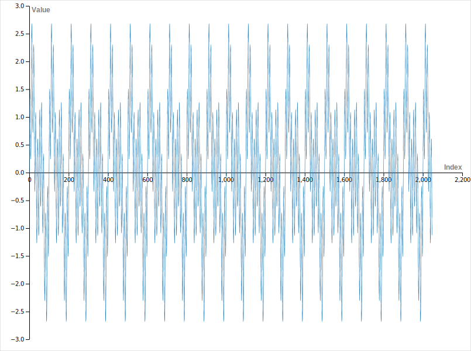
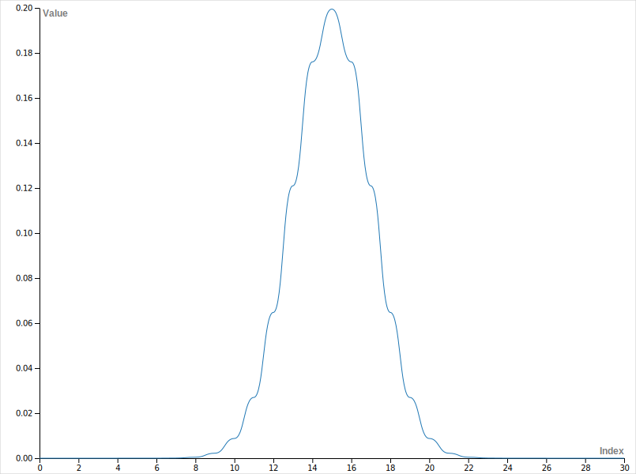
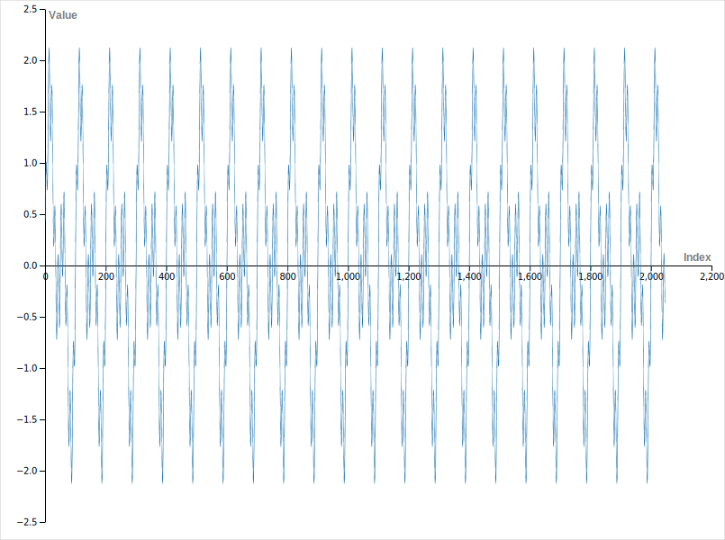
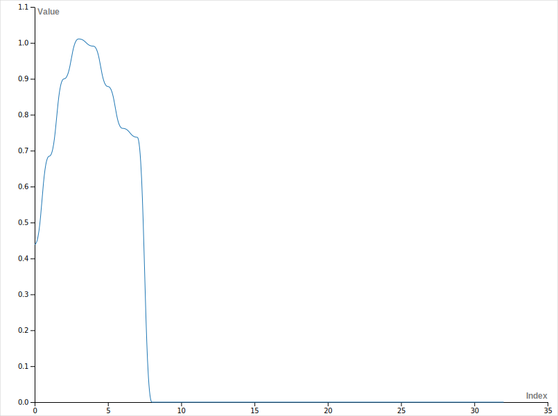

# Day 2: 1-Dimensional Convolution

TODO: 1-D Convolution of two sinusoids.

---

~~Unlike last time, I'm going to calculate the input and mask vectors at compile time - so I don't fry my laptop at runtime.~~

Can't do this yet - `std::sin` and `std::exp` - which are used by the signal generator functions actually can only be used at runtime. Maybe in cpp26 - but we'll see.

---

## Results

Here is a view of the input signal:



Gaussian Mask array:



Output array:



---

## Addendum - I messed up

When I first ran this code, I got the following output signal:



The value here goes to zero at index `8` and then stays there. This didn't seem right and after a lot of head sratching, I found my error. In `convolution.metal`, I had initially done this: First, we do a bounds check:

```C++
if (thread_id >= input_width) {
  return;
}
const uint center = static_cast<int>(mask_width/2);
```

All okay so far. Then, in the logic, I had:

```C++
for (uint i = 0u; i < mask_width; i++) {
  const int offset = static_cast<int>(i) - center; // ! Type mismatch
  // ...
}
```

Subtracting a `uint` from an `int` makes both vars `uint`s before the operation. The fix? Just change the type of the `center` to `int`.

Okay, but that doesn't explain why values become zero after index `8`. Here's the issue, in my original `main.cc` file, I had:

```C++
pCommandEncoder->dispatchThreads(numGroups, threadsPerThreadgroup);
```

So `dispatchThreads` sets the number of threads per grid. But the logic I used was for `threadsPerThreadgroup` [docs](https://developer.apple.com/documentation/metal/mtlcomputecommandencoder/dispatchthreads(_:threadsperthreadgroup:)?language=objc). To fix this, I've changed the `numGroups` to:

```C++
pCommandEncoder->dispatchThreads(MTL::Size(INPUT_SIZE, 1, 1), threadsPerThreadgroup);
```
