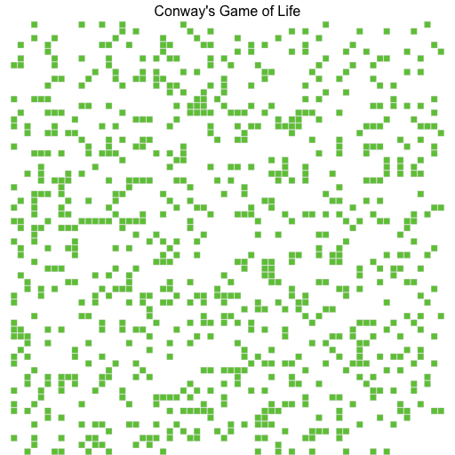

# Day 4 - Game of Life

TODO: Implement Conway's Game of Life.

## What is Conway's Game of Life?

[Conway's Game of life](https://en.wikipedia.org/wiki/Conway's_Game_of_Life) is a popular zero-player game (rather a simulation) which runs on an infinite two-dimensional grid. Each cell has two permissible states: populated and unpopulated. Which state a cell will assume is dictated by the rules.

## Results

This is the visualisation of the simulation when run for 12 generations on a 64*64 grid.



This are the benchmarks for **4096** generations for a 512*512 grid. and outputting to CSV disabled:

| Benchmark   | Time             | CPU             | Iterations |
|-------------|------------------|-----------------|------------|
| BM_Buffer   | 1263929583 ns    | 404979000 ns    | 2          |
| BM_Texture  | 2288152833 ns    | 1204870000 ns   | 1          |

I don't have a reasoning for why the texture implementation is so much slower. My first thought was that a texture could bring about some spatial locality and so be faster. But then since I'm using compiler optimisations, I thought the buffer implementation can't be THAT much slower - so I decided to try both and ... I'm surprised too.

## Logic Explanation

There is some leeway in deciding how to deal with the cells on the edges. You could:
- have a cell that crosses the edge disappear (absorb)
- mark it as the end of the grid (clamped)
- have it bounce off of the edge (reflect)
- have it wrap around to the other side of the grid (toroidal)

Toroidal is the most common  approach and also what I've done. Thanks to [Weather Vane's explanation on how to implement this](https://stackoverflow.com/questions/40430803/conway-game-of-life-toroidal-approach-rim-and-corners).

Additional thanks to my good friend, [Rohit](https://www.linkedin.com/in/rroychowdhury/) for his reference C code, he implemented the same program in CUDA as a part of the Parallel Computing course at SCU.

```C
// * serial version of game of life
void game_of_life_serial(int* grid, int m, int n, int generations) {
  int i, j, k, nbr, is_alive, *temp_grid, *temp_ptr;
  temp_grid = (int*) malloc(m*n*sizeof(int));

  for (k=0; k<generations; k++) {
    for (i=0;i<m;i++) {
	    for (j=0;j<n;j++) {
    		nbr = 0;
    		is_alive = grid[i*n+j];
    		temp_grid[i*n+j] = 0;
		    // * GOL rule check ...
	    }
    }

  	// * swap contents from temp to grid
  	temp_ptr = grid;
  	grid = temp_grid;
  	temp_grid = temp_ptr;
  	// *I've replaced this with `std::swap` but the logic stays the same
  }
  return;
}
```

## Code Explanation

The grid is a two-dimensional vector of `uint32_t` values. Each value represents the state of a cell in the grid. The grid is initialized with a random state - where each cell can be either populated (`=1`) or unpopulated (`=0`).

There are two functionally equivalent kernels, one using `MTL::Buffer` and the other using `MTL::Texture`. The texture uses a ['ping-pong'](https://www.iitk.ac.in/esc101/05Aug/tutorial/extra/fullscreen/doublebuf.html) buffer strategy to simultaneously read and write to the same texture.

A `MTL::Texture` **must** be instantiated by a `MTL::TextureDescriptor`. Defualt values suffice however thought must be given when setting `pTextureDesc->setPixelFormat(MTL::PixelFormatR32Uint);`. I've chosen [`MTL::PixelFormatR32Uint`](https://developer.apple.com/documentation/metal/mtlpixelformat/r32uint?language=objc) because it's the most apt analogue for the `uint32_t` values in our grid. I have not explored if using a packed/compressed format would be wiser.

The texture implementation passes the grid on which the simulation is to be run as a two-dimensional texture. This is simply a notation however so denoting it as a columnar buffer is _totally_ viable - that's exactly how the buffer implementation works.

The driver methods `golSimXX()` call the kernels and are responsible for iterating over the number of generations. Each call to the kernel advances the simulation by one generation.

`saveFrame` is a lambda defined inside `main` (and then passed in context as a `std::function`) which stores the current state of the game in a .csv file.

---

## Learnings

### Buffers and Textures

Today's code has two functionally equivalent kernels, the difference lies in the data structure used. MSL allows one to store data in either a `MTL::Buffer` or a `MTL::Texture`. Per [Apple's documentation](https://developer.apple.com/library/archive/documentation/Miscellaneous/Conceptual/MetalProgrammingGuide/Mem-Obj/Mem-Obj.html#//apple_ref/doc/uid/TP40014221-CH4-SW1): "Buffers Are Typeless Allocations of Memory" and "Textures Are Formatted Image Data".

A Buffer is linear, it can be understood as an analogue of [`cudaMalloc`](https://docs.nvidia.com/cuda/cuda-runtime-api/group__CUDART__MEMORY.html#group__CUDART__MEMORY_1g37d37965bfb4803b6d4e59ff26856356). Textures's (often used in rendering graphics) are mostly to be viewed, not modified, equivalent to [Texture Objects](https://docs.nvidia.com/cuda/cuda-c-programming-guide/#texture-object-api) in CUDA. And just like CUDA, instantiating a `MTL::Texture` must only be done through it's corresponding descriptor object. Hypothetically, anything a texture demands can be done in a buffer as well and the disection is mostly to clarify access patterns (knowledge of this makes it easier to optimise the code). MSL defines access patterns for a `MTL::Texture`. Per the referenced Apple docmumentation,

> "Both the CPU and GPU can access the underlying storage for a `MTL::Resource` object. However, the GPU operates asynchronously from the host CPU, so keep the following in mind when using the host CPU to access the storage for these resources."

... which is why `MTLCommandEncoder.hpp` defines the following enumeration:

```C++
_MTL_OPTIONS(NS::UInteger, ResourceUsage) {
  ResourceUsageRead   = 1,
  ResourceUsageWrite  = 2,
  ResourceUsageSample = 4,
};
```

### Vector Datatypes

The MSL spec adds so called 'vector datatypes' - which like the name implies, are a way to represent multiple values in a single variable (just like a [vector](https://en.wikipedia.org/wiki/Vector_(mathematics_and_physics)#Vector_quantities)). Traditionally (from my own experience), quantities like a latitude,longitude can be denoted by a `std::pair` tuple. MSL provides types like `uintn` to denote a tuple of `n` unsigned integers. In paricular, today's code uses this type to denote the position of a thread in a 2D grid. Snippet:

```C++
kernel void golBuffer (
  ...
  uint2 thread_id [[thread_position_in_grid]]
) {
```

A 2D grid requires two identifiers, so I've used `uint2` (if it were a 3D grid, it'd be `uint3`). A common usecase for these is to denote colours.A RGBA value can be represented by a `uint4` type.

### Choosing Pixel Formats

I have zero idea about mipmaps and stuff and so deciding on a [Pixel format](https://developer.apple.com/documentation/metal/understanding-color-renderable-pixel-format-sizes?language=objc) was confusing. Initially, I decided to represent the state of every cell with a `uint8_t` - so that I save as much memory as possible. Consequently, I'd use `MTL::PixelFormatR8Uint` so that each pixel is stored as a single `uint8_t`. However, while reading from the texture, I was using a `uint4` which means the GPU is forced to read and write 4 bytes for every byte of actual data. This looks like this:

```C++
output_texture.write(uint4(new_state, 0, 0, 1), thread_id);
```

I then changed things to `uint32_t` so at least there's no padding wasting our memory.

### What is a Swizzle?

To my understanding, a [swizzle](https://developer.apple.com/documentation/metal/mtltexturedescriptor/swizzle) is a kind of multiplexer. It's defined as a ["pattern that modifies the data read or sampled from a texture by rearranging or duplicating the elements of a vector"](https://developer.apple.com/documentation/metal/mtltextureswizzlechannels). I've had to incorporate this (big thanks to [this](https://stackoverflow.com/questions/66485577/how-to-write-the-texture-function-from-shadertoy-to-metal-shading-language) discussion) when using `.x` to access the first component of a texture here:

```C++
// The '.x' swizzle gets the first channel, which holds our 0 or 1 value.
uint32_t neighbor_state = static_cast<uint32_t>(input_texture.read(uint2(neighbor_x, neighbor_y)).x);
```

and when we do

```C++
output_texture.write(new_state, thread_id);
```

we're actually invoking the [`shaderWrite`](https://developer.apple.com/documentation/metal/mtltextureusage/shaderwrite) property, used to write to a texture.

---

## Notes for the future

I'm not sure if `MTL::PixelFormatR8Unorm`, or even `bool` for that matter is the best choice here. I'd like to revisit this and try with smaller types.
