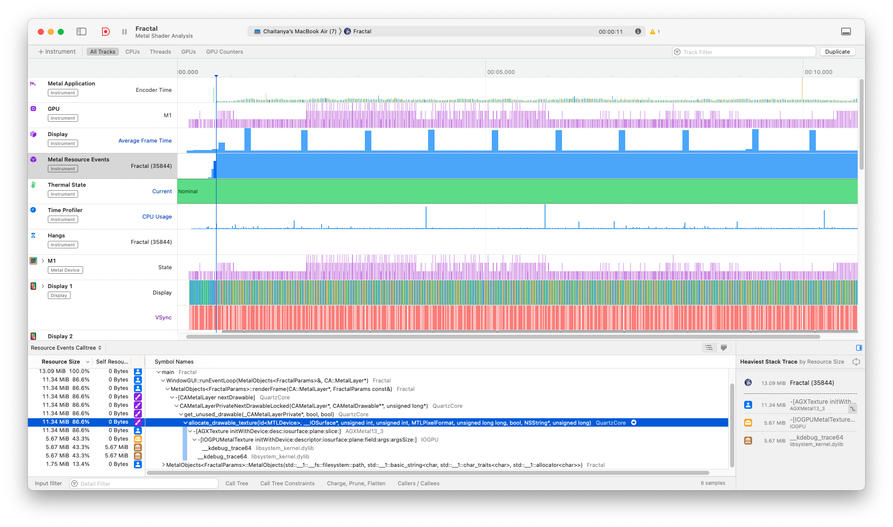

# Mandelbrot Fractal

TODO: Render the Mandelbrot fractal.

### How to use

Run the `Makefile` to build the executable. You can use the executable directly or alternatively, if you want some easier access through the Mac UI 💅, you can run the `bundle.sh` script to create a `.app` application bundle. This can then be used as a standalone app.

## Results

[Demo Video]("../assets/recording.mov"). I've only just gotten started with the Intruments profiler. And I tried two things, one was to see what takes up most of my compute - what a profiler is meant for.

<p align="center">
  
</p>

The other thing I saw (and also something that Apple recommends you should test) is how long it takes to render one frame. In the above snapshot we see one frame typically takes around 13.3 milliseconds, which corresponds to a frame rate of 1000/13.3 ≈ 75 FPS. Pretty good.

<p align="center">
  
</p>

## What is the Mandelbrot Fractal?

It's a set of repeating self-similar shapes. It follows the relation `z[n+1] = z[n]^2 + c` where `z` is a complex number and `c`, called the 'parameter', is a complex constant. The Mandelbrot set is then the set of all values of `c` so that the relation does not fly off to infinity. [This article from the University of Kent](https://blogs.kent.ac.uk/onetwomany/2020/04/24/deterministic-vs-predictable-the-mandelbrot-set/) offers the best explanation in my opinion.

## Logical Explanation

There are two components to the whole app. First, we must render the fractal. And second, we must allow the user to browse around.

### MSL Code

The MSL Code is pretty straightforward. I find it's been one of the most direct translations of logic into code yet.

Our condition per the rules is to ensure that the radius of the circles never exceeds 2. So we _should_ be checking if the root of the principal components is less than or equal to 2. Calculating the square-root is an avoidable calculation and so we just do `if (dot(z, z) > 4.0f)`.

Lastly, we have the logic for adding colour to our fractal. For a nice gradient, I've used sinusoids, a pretty common technique as it turns out.

```C++
float t = 0.1f * smooth_i;
float r = 0.5f + 0.5f * sin(t + 0.0f);
float g = 0.5f + 0.5f * sin(t + 2.094f); // 120 degrees phase shift
float b = 0.5f + 0.5f * sin(t + 4.188f); // 240 degrees phase shift
```

... which correspond to the RGBA values.

### Understanding the Simple DirectMedia Layer (SDL)

[SDL3 was released early this year](https://gamefromscratch.com/sdl-3-released/) and with it came an amazing set of features to better support Metal. With native Metal API integration, it's possible to use Metal in cpp without metal-cpp altogether. But I didn't do that. I've used metal-cpp anyway and used SDL alongside, mostly for window management.

### Core Animation Layer

The `CA::MetalLayer` rendering surface that bridges Apple's Metal graphics API with windowing systems like SDL. It acts as the target for GPU-rendered content, managing drawable textures presented in your app's window. I got a very good understanding of this from the [Schneide Blog](https://schneide.blog/2022/03/28/metal-in-c-with-sdl2/).

### Seasoning with attributes

I have added two optimisation directives in this code. The important one is atop this function definition:

```C++
[[nodiscard("The returned MetalLayer must be configured and used.")]]
auto initMetalLayer(WindowGUI& windowGUI) -> CA::MetalLayer*
```

The `[[nodiscard]]` attrribute ensures that an object returned by this function is actually used and not forgotten. I have added it here as forgetting to use it could introdude a dangling pointer. I also added:

```C++
if (!pDrawable) [[unlikely]] { return; }
```

This just tells the compiler that the condition is unlikely and allows the compiler to optimize the code accordingly. I typically wouldn't bother with this but the `renderFrame` method (which this snippet belongs to) is called often and every little bit helps.

### a step towards safety ...

I remember trying to use smart pointers before and I've finally made it happen. I tested it with [`leaks`](https://developer.apple.com/library/archive/documentation/Performance/Conceptual/ManagingMemory/Articles/FindingLeaks.html) and happily, but also not surprisingly there were no leaks. I was doing two things wrong. Firstly, there isn't a direct equivalent of `std::make_unique` in Objective-C, so the best other option is to use `NS::RetainPtr`. The other thing I was doing wrong was scoping the `AutoReleasePool` within the `MetalObjects` constructor. When I initially did this, the pool would delete the members of this struct (all good). Then the smart pointer would join and find it's objects were already deleted. Bam. So to fix this, I've moved the `AutoReleasePool` to the `main()` block so it let's the smart pointers do it's thing.

## Notes

I owe a big thanks to [Jacob](https://mastodon.social/@jtbandes) for writing [this blog post](https://bandes-stor.ch/blog/2016/02/21/drawing-fractals-with-minimal-metal/) - it's the first time I heard about Metal and well... I forgot about it until now. Happy I could finally make it work.
